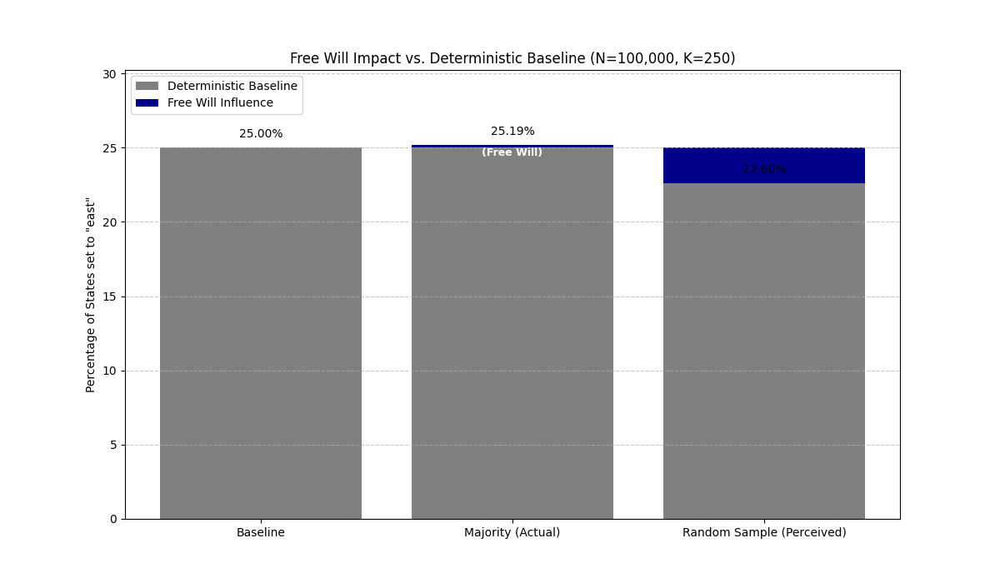

# 🌌 The Multi-Hop Influence Model: A Simulation of Free Will in a Causal Universe

## Project Overview

This project presents a novel **compatibilist framework** to model the classic philosophical conflict between **determinism** and **free will**. Instead of treating them as mutually exclusive concepts, this model proposes that **free will is a measurable, finite influence operating within a vast, deterministic (or causal) system.**

The core mechanism is the simulation of a **diminishing causal gradient**—our conscious choices exert a high degree of influence locally, but this influence rapidly diminishes as it propagates outward through the universe.

## 💡 The Core Philosophical Idea

The framework resolves the perceived paradox of free will vs. determinism by using the mathematics of scale and influence:

### 1\. The Total Causal System ($N$)

We define the **universe** (the totality of all variables, forces, and historical states) as a massive set of entities, $N$, where $N$ approaches infinity. This vast collection represents the **deterministic background** or the complete causal chain. Everything that happens is necessitated by the prior state of these $N$ entities.

### 2\. The Locus of Agency ($K$): Our Free Will

Within this set $N$, there is a tiny, manageable subset of variables, $K$, that we, as conscious agents, can **directly control**. These are our immediate thoughts, volitions, and actions. We refer to these as **0-Hop Entities** (zero-degree separation from the will). This is the measurable source of free will.

### 3\. The Multi-Hop Influence Gradient

Our influence does not stop at $K$, but it spreads across a defined causal distance, losing power with each step—the "hop." This is modeled by an influence coefficient, $a_i$, which drops off significantly as the hop distance increases:

  * **0-Hop ($a_0$):** **Direct Control.** Our personal choices (e.g., deciding to stand up).
  * **1-Hop ($a_1$):** **High Influence.** Entities directly adjacent to us (e.g., family, colleagues, immediate environment). Our action directly and significantly alters their state.
  * **2-Hop ($a_2$):** **Low Influence.** Indirectly affected entities (e.g., a person across the city, a random market price).
  * **$n$-Hop ($a_n \rightarrow 0$):** **Negligible Influence.** Distant variables (e.g., "a man jumping in America," distant astronomical events).

### 4\. The Conclusion: Diminished Agency

Our total life/influence ($F$) is a complex function of the influence we exert across the entire set of $N$ variables:
$$F = f(a_0 \cdot N_{0}, a_1 \cdot N_{1}, a_2 \cdot N_{2}, \dots)$$

The simulation visually confirms the thesis:

> While our free will (the control over the $K$ variables) is $100\%$ real, its contribution to the final state of the overwhelmingly large system ($N$) is mathematically **negligible**. We have genuine agency, but the vast, indifferent, and largely predetermined universe dictates the outcome, giving the *feeling* of being fully determined.

This model moves the argument from an **either/or** paradox to a **question of scale and measurable input**.

-----

## 💻 The Simulation and Modeling Approach

The project uses a simple simulation to demonstrate this abstract idea using quantifiable metrics.

### Simulation Setup

| Parameter                     | Interpretation                                         | Role                                      |
| :---------------------------- | :----------------------------------------------------- | :---------------------------------------- |
| **$N$ (Total States)**        | The universe size (e.g., 100,000)                      | The deterministic background.             |
| **$K$ (Controllable States)** | Our free will locus (e.g., 250)                        | The small, controllable input.            |
| **Action Space**              | Directions (N, S, E, W)                                | Represents the choices we can make.       |
| **Intervention**              | Overwriting $K$ states with one choice (e.g., 'North') | The exercise of free will (0-hop action). |

### Analysis Methods

The simulation employs two primary sampling methods to highlight the difference between **actual** and **perceived** influence:

1.  **Majority Sampling (Actual Influence):** Calculates the percentage of the free-will choice (e.g., 'North') across the entire $N$ system. This reveals the **true, tiny contribution** to the global state.
2.  **Random Sampling (Perceived Influence):** Calculates the percentage of the choice within a small, local sample of the system. This demonstrates how **local observation** (our personal experience) can be skewed by random variation, often **overstating our global impact.**

-----

That's right, a powerful **Conclusion** is essential for wrapping up a philosophical argument and summarizing its impact.

Here is a concise, impactful conclusion section that you can add to your README, immediately following the "Core Philosophical Idea" or the "Simulation and Modeling Approach."

***

##  निष्कर्ष (Conclusion) 🎯

The **Multi-Hop Influence Model** offers a compelling resolution to the ancient debate between determinism and free will, transforming it from a binary choice into a **problem of measurable scale**.


## 💾 Simulation Results

The simulation output is saved in the `output/` directory:
* **Metrics:** **[View the complete simulation parameters and metrics in fields.json](../output/FreeWillSimulation_Run/fields.json)**

The simulation's findings are stark: our **free will** is demonstrably real—it is the source of the $+0.19\%$ increase in the system's state—but its effect is profoundly **diminished** when measured against the overwhelming vastness of the causal universe ($N$).

### Key Takeaways

* **Free Will is Agency, Not Omnipotence:** Our choices are genuine and originate from within our $K$-variables, validating subjective agency. However, they do not provide the power to significantly alter the system's global trajectory, validating the objective observation of determinism.
* **The Power of Scale:** The model confirms that **Determinism** is dominant not because free will is an illusion, but because the set of *uncontrolled* variables ($N-K$) is so large that the effect of $K$ is diluted to near-zero.
* **Reconciling Subjectivity and Objectivity:** When we experience the world locally (**Random Sampling**), our choices feel highly impactful because local variation magnifies our influence. When measured objectively against the whole universe (**Majority Sampling**), that influence is revealed to be minute.

This framework successfully reconciles the subjective experience of freedom with the objective appearance of causality, presenting a robust **compatibilist** view where agency is a necessary, albeit infinitesimal, input into the causal engine of the cosmos.

***


## 🌌 Code Analysis

This document details the design and implementation of the **Free Will Experiment**, which utilizes the **Multi-Hop Influence Model**—a novel **compatibilist framework**—to explore the interplay between deterministic systems and individual agency.

-----

## 1\. 💡 The Core Philosophical Hypothesis

The model proposes that **free will is a measurable, finite influence operating within a vast, deterministic (or causal) system**, resolving the classic paradox through the mathematics of scale.

### The Scale Paradox

1.  **The Total Causal System ($\mathbf{N}$):** Defined as a massive, near-infinite set of entities representing the **deterministic background** of the universe.
2.  **The Locus of Agency ($\mathbf{K}$):** A tiny, manageable subset of variables that a conscious agent can **directly control**. This is the measurable source of free will.
3.  **The Multi-Hop Influence Gradient:** Our influence spreads, losing power with each step ("hop")—modeled by an influence coefficient $a_i$ that rapidly diminishes.
4.  **Conclusion: Diminished Agency:** Our direct influence ($K$) is real, but because the total system ($N$) is overwhelmingly massive, the actual, global impact of our free will choices is mathematically negligible.

> **Thesis:** Free Will (control over $K$) is $100\%$ real, but its contribution to the final state of the overwhelmingly large system ($N$) is so small that the universe appears fully determined.

-----

## 2\. 💻 Implementation Details (Mapping to Code)

The simulation is executed by the **`Simulation`** class (in `src/simulations_exps/free_will.py`) and relies on **`SimpleVectorWorld`** (in `src/worlds/simple_vector_world.py`) for its environment state.

### Code Mapping

| Parameter                | Code Variable           | Interpretation                                                                       |
| :----------------------- | :---------------------- | :----------------------------------------------------------------------------------- |
| **Universe Size**        | `self.N`                | Total size of the state vector. The deterministic background.                        |
| **Free Will Locus**      | `self.K`                | The number of indices overwritten by the *will* (intervention).                      |
| **Deterministic States** | `self.initial_states`   | The state of $N$ entities before intervention.                                       |
| **Free Will Action**     | `self.FREE_WILL_CHOICE` | The specific choice applied to the $K$ indices (e.g., `'North'`).                    |
| **Observer Sample**      | `self.SAMPLE_SIZE`      | The size of the random group sampled by an observer (source of perceived influence). |

### Core Logic in `Simulation.run_step()`

The intervention is modeled as an **external override** on the deterministic state, representing the *effect* of free will:

```python
def run_step(self):
    # 1. Start with the deterministic baseline (N states)
    deterministic_states = self.world.initial_states.copy()  

    # 2. Apply the 'Free Will' override at the K indices (The intervention)
    self.final_states = deterministic_states.copy()
    self.final_states[self.k_indices] = self.FREE_WILL_CHOICE

    # Update the world state to the final outcome
    self.world.current_states = self.final_states.copy()
```

-----

## 3\. 📊 Analysis: Actual vs. Perceived Influence

The simulation compares two measurements of the final state to visualize the scale paradox.

| Metric                  | Calculation                                                            | Interpretation                                                                                                    |
| :---------------------- | :--------------------------------------------------------------------- | :---------------------------------------------------------------------------------------------------------------- |
| **Majority Percentage** | % of `FREE_WILL_CHOICE` in **all $N$ states** after intervention.      | The **Actual Influence**. The tiny, true contribution of $K$ to the global state.                                 |
| **Random Percentage**   | % of `FREE_WILL_CHOICE` in a random $SAMPLE\_SIZE$ after intervention. | The **Perceived Influence**. The highly variable, local observation of influence, often skewed by sampling noise. |

### Visual Impact

The generated plot demonstrates:

  * **Baseline:** The height of the deterministic background (gray).
  * **Majority (Actual Influence):** The small, consistent blue increase, representing the $\frac{K}{N}$ ratio effect.
  * **Random (Perceived Influence):** The blue increase for the random sample, illustrating how **local observation** can exaggerate or misrepresent the true global effect.

-----

## 4\. 📈 Impact of Key Variables

The hypothesis is tested by varying the parameters $N$, $K$, and $SAMPLE\_SIZE$.

### A. The Ratio of $K$ to $N$ (Agency vs. Universe Scale)

This ratio is the core determinant of the **Actual Free Will Influence**.

$$\text{Actual Influence} \approx \left(\frac{K}{N} \times 100\right)$$

| Scenario             | $N$    | $K$    | Ratio ($K/N$) | Expected Actual Influence                           |
| :------------------- | :----- | :----- | :------------ | :-------------------------------------------------- |
| **High Determinism** | $10^6$ | $10^2$ | $0.01\%$      | Negligible change from baseline.                    |
| **Moderate Agency**  | $10^5$ | $10^4$ | $10.0\%$      | A noticeable, but still globally limited, increase. |

**Observation:** As $N$ drastically outstrips $K$, the **Actual Free Will Influence** (Majority Percentage) is diluted toward zero, confirming the thesis of diminished agency.

### B. The Random Sample Size (Observer Bias)

This parameter dictates the fidelity of the observer's *perception* of influence.

| Scenario                        | Sample Size     | $N$    | $K$    | Expected Perceived Influence                                                                                             |
| :------------------------------ | :-------------- | :----- | :----- | :----------------------------------------------------------------------------------------------------------------------- |
| **Small Sample (e.g., 500)**    | $S \ll N$       | $10^5$ | $10^4$ | Influence is highly variable and unstable due to noise, potentially exaggerating the impact.                             |
| **Large Sample (e.g., 50,000)** | $S \approx N/2$ | $10^5$ | $10^4$ | Influence will converge closely to the **Majority Percentage**, as the sample accurately reflects the true system state. |

**Observation:** A smaller $SAMPLE\_SIZE$ relative to $N$ increases the discrepancy between the **Actual** and **Perceived** influence, supporting the idea that subjective experience often misrepresents global causal power.